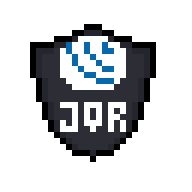
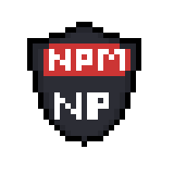
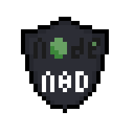
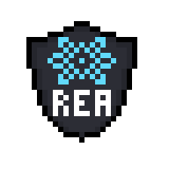

 
      
    
  # Hi, I'm Marih! :D
  
  
   
    
    
  
  ### 👩‍💻 About me
  

I am a developer in training, currently studying self-taught.

  ### 🏆 my skills

  
  - 📚 [certificates](https://drive.google.com/drive/folders/15Kvz6iILwgV4mcoZws0UEzjk_TUuilGA?usp=sharing) 
  
  - 📫 where to find me -> marih44985@gmail.com
  
    
  

 
  

  
  

     
    

